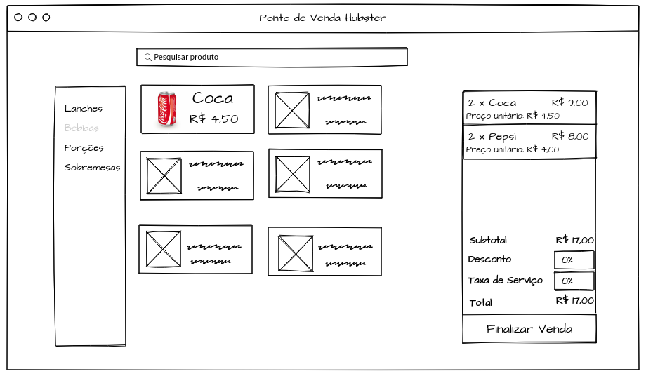

<h1 align="center">
  
</h1>

<blockquote align="center">Seu restaurante a todo vapor!</blockquote>

<h3 align="center">
  Desafio Front-end Hubster
</h3>

  
  
  
  

  <a href="#-sobre-a-hubster">Sobre a Hubster</a>&nbsp;&nbsp;&nbsp;|&nbsp;&nbsp;&nbsp;
  <a href="#️-esboço">Esboço</a>&nbsp;&nbsp;&nbsp;|&nbsp;&nbsp;&nbsp;
  <a href="#-entrega">Entrega</a>

## 🐹 Sobre a Hubster

Estamos construindo uma plataforma de gerenciamento para food services com intuito de ajudar
os restaurantes a administrarem seus pedidos, controle de estoque, financeiro, etc. Para isso, estamos realizando a integração com os principais aplicativos de delivery (iFood, Rappi e Uber Eats).

### Instruções

- Você deverá consumir a seguinte API:
  [http://5d556e6936ad770014cce06d.mockapi.io/api/v1/catalog/products](http://5d556e6936ad770014cce06d.mockapi.io/api/v1/catalog/products).
- Você deverá usar HTML, CSS e Javascript com algum framework — React, Angular, Vue ou Backbone.

### Pontos a serem avaliados

- Componentização
- Performance
- Escalabilidade
- Usabilidade
- Manutenibilidade

### Funcionalidades

Abaixo estão descritas as funcionalidades que você deve adicionar em sua aplicação.

- Listar os produtos da API conforme mostra o **esboço**.
- Os produtos poderão ser filtrados por categoria através de um sidebar.
- Só uma categoria é ativa por vez.
- Ao clicar em um produto, o mesmo deve ser adicionado no carrinho de compras.
- Produtos repetidos devem ser agrupados no carrinho.
- O valor da soma de todos os produtos deve ser mostrado no campo de subtotal.
- Pode-se aplicar um desconto ao subtotal da venda.
- O desconto pode variar de 0 a 100% e deve ser aplicado a soma do valor de todos os produtos.
- Deve haver um botão de finalizar venda no final do carrinho que quando clicado limpará o carrinho e mostrará uma mensagem de venda concluída.

---

## 🖼️ Esboço

<h1 align="center">
  
</h1>

---

## 📅 Entrega

Esse desafio **precisa ser entregue através de algum repositório** em até **7 dias** e será avaliado por nós de acordo com os pontos citados acima.

## 💬 FAQ
- O repositório do projeto no github deve ser mandado por email na data acordada na
entrevista.
- Mesmo se não tiver terminado todos os requisitos a tempo, envie o que fez. Tudo
será avaliado.
- Da mesma forma, se terminar o teste antes, aproveite o tempo restante para fazer
melhorias no código. Aproveite o tempo da melhor maneira possível.
- Fique a vontade para aplicar o design que quiser no projeto, só não fuja muito do
esboço proposto. Mas não perca muito tempo com isso, foque primeiramente na
usabilidade.

## Contato
Pode mandar um email para: vinicius.sales@hubster.com.br ou joao.matheus@hubster.com.br para tirar dúvidas.

### Boa sorte!

---

Feito com 💛 by Hubster
